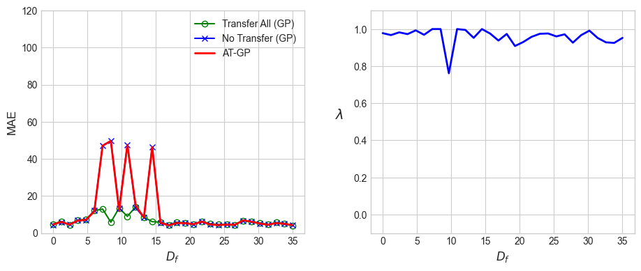
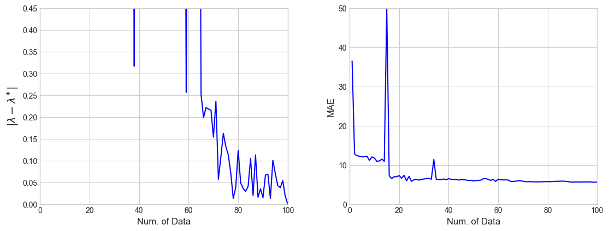

# Adaptive Transfer Gaussian Process (AT-GP) Implementation

This repository contains a Python implementation of the Adaptive Transfer Gaussian Process (AT-GP) model, as described in the paper "Adaptive Transfer Learning for Gaussian Processes" by Cao et al. (AAAI 2011). The implementation also includes standard Gaussian Process (GP) baselines and reproduces several experiments from the paper, including a synthetic experiment (Figure 4) and experiments on real-world datasets (Wine, SARCOS) and a simulated WiFi localization task.

## Core Concept: Adaptive Transfer Learning with Gaussian Processes

Transfer learning aims to leverage knowledge from a (typically data-rich) **source domain** to improve learning performance in a related but different (typically data-scarce) **target domain**.

The AT-GP model extends Gaussian Processes for regression tasks in a transfer learning setting. The key idea is to learn a **transferability parameter `lambda`** (λ) that quantifies the relationship between the source task and the target task.

-   **`lambda`**: This parameter ranges from -1 to 1.
    -   `lambda` ≈ 1: Strong positive correlation. Source data is highly relevant and directly beneficial.
    -   `lambda` ≈ 0: No strong correlation. Source data is largely irrelevant; the model behaves like a standard GP trained only on target data.
    -   `lambda` ≈ -1: Strong negative correlation. Source data is inversely related (though the model primarily aims to leverage positive transfer).

The `lambda` parameter is not directly optimized. Instead, it is derived from two other hyperparameters, `b` and `mu` (µ), using the formula:
`lambda = 2 * (1 / (1 + mu))^b - 1`
These hyperparameters (`b`, `mu`), along with the kernel hyperparameters (length scale, signal variance) and noise variances for source and target domains, are learned by maximizing the **conditional log marginal likelihood (LML)** of the target data given the source data.

The AT-GP model constructs a joint covariance matrix for predictions that incorporates both source and target data, with the cross-covariance terms between source and target scaled by this learned `lambda`.

## Implementation Details

-   **`SquaredExponentialKernel`**: Implements the Squared Exponential (or RBF) kernel.
-   **`ATGP` class**:
    -   `__init__`: Initializes the model with source data (X_S, y_S) and target data (X_T, y_T).
    -   `_get_lambda`: Computes lambda from `b` and `mu`.
    -   `log_marginal_likelihood_conditional`: Calculates the conditional LML used for hyperparameter optimization.
    -   `fit`: Optimizes hyperparameters (kernel params, `b`, `mu`, noise_S_std, noise_T_std) using `L-BFGS-B`.
    -   `predict`: Makes predictions on new target inputs (X_star_T) using the learned parameters and the AT-GP predictive equations.
-   **`SimpleGPR` class**:
    -   A standard Gaussian Process Regressor used for baseline comparisons.
    -   Optimizes its hyperparameters (kernel params, noise_std) by maximizing the LML on its training data.
-   **Metrics**:
    -   `nmse`: Normalized Mean Squared Error.
    -   `mae`: Mean Absolute Error.
    -   `error_distance`: Mean Euclidean distance between true and predicted vectors (equivalent to RMSE for 1D output).
-   **Data Preprocessing**: `StandardScaler` from `scikit-learn` is used for feature scaling.

## Experiments

The script includes several experiments to demonstrate and evaluate the AT-GP model:

1.  **Figure 4 Reproduction (`run_figure4_experiment`)**:
    -   **Goal**: Replicates Figure 4 from the Cao et al. paper.
    -   **Setup**:
        -   Source task: `y = sinc(x)` for `x` in `[-15, -5]`.
        -   Target task: `y = sinc(x - Df) + offset` for `x` in `[5, 15]`. `Df` (`Df_strength_fig4`) controls the discrepancy.
        -   The number of labeled target training samples is varied from 1 to 100.
    -   **Output**: Plots showing:
        1.  `|lambda - lambda*|` vs. Number of Target Data Points (where `lambda*` is learned using all available target training data).
        2.  MAE on a fixed target test set vs. Number of Target Data Points.
    -   This experiment demonstrates how `lambda` converges and how prediction accuracy improves as more target data becomes available.

2.  **Simulated WiFi Localization (`run_simulated_wifi_experiment`)**:
    -   **Goal**: Evaluate AT-GP on a synthetic multi-dimensional regression task simulating WiFi signal strength based localization.
    -   **Setup**:
        -   Source and target tasks are linear regressions with related but different weight vectors and input distributions.
    -   **Metric**: Error Distance.

3.  **SARCOS Robot Arm (`run_sarcos_experiment`)**:
    -   **Goal**: Apply AT-GP to a real-world robotics problem.
    -   **Data**: `sarcos_inv.mat` (inputs) and `sarcos_inv_test.mat` (outputs/torques).
        -   Source task: Predict torque for the 1st joint.
        -   Target task: Predict torque for the 2nd joint, using a small fraction of labeled data.
    -   **Metric**: NMSE.
    -   **Note**: The SARCOS dataset files (`sarcos_inv.mat`, `sarcos_inv_test.mat`) are not included and need to be downloaded separately (e.g., from [GaussianProcess.org](http://www.gaussianprocess.org/gpml/data/)). The script expects them in the same directory or requires path adjustment.

4.  **Wine Quality (`run_wine_experiment`)**:
    -   **Goal**: Transfer knowledge between two types of wine quality prediction.
    -   **Data**: UCI Wine Quality dataset.
        -   Source task: Predict quality of white wine.
        -   Target task: Predict quality of red wine, using a small fraction of labeled data.
    -   **Metric**: NMSE.
    -   **Note**: The script attempts to download data directly from the UCI ML repository.

### Baselines Compared

For the dataset experiments (WiFi, SARCOS, Wine), AT-GP is compared against:
-   **No Transfer GP**: A `SimpleGPR` trained *only* on the (limited) target training data.
-   **Transfer All GP**: A `SimpleGPR` trained on the concatenation of all source data and the (limited) target training data. Source data features are re-scaled to match the target domain's scaler before concatenation.

## How to Run

1.  **Prerequisites**:
    -   Python 3.x
    -   NumPy
    -   SciPy
    -   Pandas
    -   Scikit-learn
    -   Matplotlib

    You can install these using pip:
    ```bash
    pip install numpy scipy pandas scikit-learn matplotlib
    ```

2.  **Data (for SARCOS)**:
    -   Download `sarcos_inv.mat` and `sarcos_inv_test.mat`.
    -   Place them in the same directory as the Python script, or update the paths in the `run_sarcos_experiment` function.

3.  **Execution**:
    Run the Python script from your terminal:
    ```bash
    python your_script_name.py
    ```
    (Replace `your_script_name.py` with the actual name of the file).

4.  **Configuration**:
    Key parameters for experiments can be modified at the end of the script within the `if __name__ == '__main__':` block:
    -   `verbose_opt_fig4`, `verbose_opt_experiments`: Set to `True` for detailed optimization output from `scipy.optimize.minimize`.
    -   `random_seed_fig4`, `random_seed_experiments`: Seeds for random number generation to ensure reproducibility.
    -   `Df_for_fig4`: Discrepancy factor for the Figure 4 experiment.

## Expected Output

-   Console output detailing the progress of each experiment and the final performance metrics (NMSE or Error Distance).
-   For the Figure 4 experiment, a Matplotlib window will pop up displaying the two plots.

### Example Figure 4 Output:

This plot is generated by the `run_figure4_experiment` function. It shows how the learned transfer parameter `lambda` converges towards an optimal `lambda*` (left) and how the Mean Absolute Error (MAE) on a test set decreases (right) as more labeled data from the target domain is used for training the AT-GP model.




## References

-   Cao, B., Pan, S. J., Zhang, Y., Yeung, D. Y., & Yang, Q. (2011). Adaptive transfer learning for Gaussian processes. In *Proceedings of the AAAI Conference on Artificial Intelligence* (Vol. 25, No. 1).
